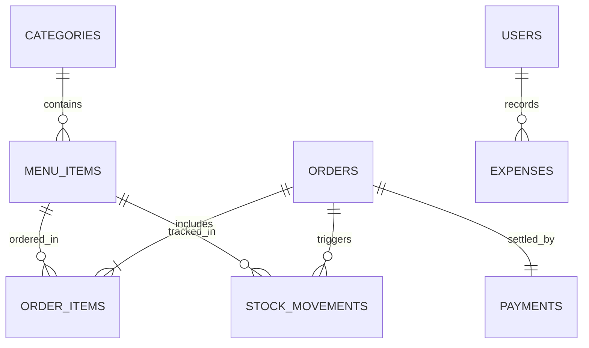
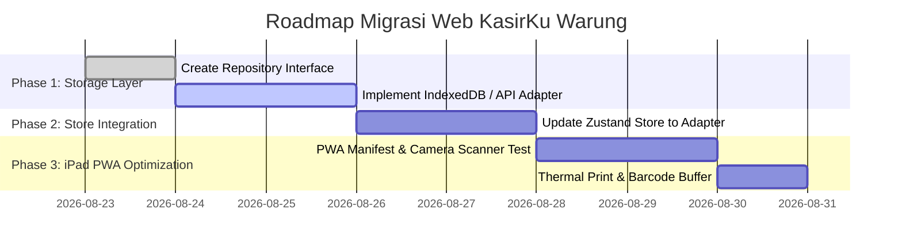

# Product Requirement Document (PRD) — KasirKu Warung (Web-Ready & iPad Compatible)

Dokumen ini memuat analisis dan rancangan arsitektur komprehensif **"hingga ke akar-akarnya"** untuk migrasi dan pengembangan aplikasi **KasirKu Warung** dari desktop (Tauri/Rust) menjadi **Aplikasi Web Cross-Platform (PWA/Web-Ready)** yang dapat diakses melalui browser di iPad, Tablet Android, Laptop, maupun PC.

---

## 1. Visi Produk & Latar Belakang Migrasi Web

### 1.1. Latar Belakang Migrasi
Aplikasi awal dikembangkan menggunakan Tauri v2 (Rust + SQLite) untuk desktop Windows. Namun, karena aplikasi kasir toko ritel/warung modern membutuhkan portabilitas tinggi pada perangkat **Apple iPad / Tablet Touchscreen**, arsitektur aplikasi dialihkan 100% menjadi **Web Application / Progressive Web App (PWA)**.

### 1.2. Visi & Target Pengguna
- **Target Utama**: Toko Ritel, Minimarket, Warung Kelontong, Toko Kelontong Modern, Toko Kelontong Eceran & Top-Up.
- **Perangkat Operasional**: Apple iPad (Safari/Chrome), Tablet Android, Touchscreen POS Stand, atau PC/Laptop Web Browser.
- **Prinsip Operasional (Single-User / Owner-Operated)**:
  - Tanpa hambatan login/password yang rumit (Zero Friction Startup).
  - Dioperasikan langsung oleh pemilik warung / kasir utama.
  - Fokus utama pada kecepatan transaksi kasir, pemindaian barcode fisik/kamera, pencatatan stok otomatis, dan perhitungan keuntungan kotor & bersih.

---

## 2. Arsitektur Sistem & Tech Stack (Web & Database Agnostic)

Arsitektur aplikasi dirancang menggunakan pola **Storage Adapter / Repository Pattern** yang memisahkan penuh antara **Presentation Layer (Frontend)** dan **Data Access Layer (Backend/Database)**.

```
┌─────────────────────────────────────────────────────────────────────────────┐
│                          PRESENTATION LAYER (FRONTEND)                      │
│   React 19 + TypeScript + Vite + Zustand v5 + Framer Motion + Tailwind/CSS  │
└──────────────────────────────────────┬──────────────────────────────────────┘
                                       │
                        Storage Adapter (Repository API)
                                       │
┌──────────────────────────────────────┴──────────────────────────────────────┐
│                    DATA ACCESS LAYER (DATABASE AGNOSTIC)                    │
│   (Pilih Salah Satu Provider Backend Tanpa Mengubah Kode Frontend)          │
├───────────────────┬───────────────────┬──────────────────┬──────────────────┤
│ IndexedDB (Local) │ Supabase / BaaS   │ Node.js / Express│ Laravel / PHP    │
│ (Offline PWA)     │ (Cloud PostgreSQL)│ (REST API / SQL) │ (MySQL / Postgres│
└───────────────────┴───────────────────┴──────────────────┴──────────────────┘
```

### 2.1. Frontend Stack (Preserved 100% Design & Logic)
- **Core Framework**: React 19 + TypeScript + Vite (Fast HMR & Optimized Web Build).
- **State Management**: **Zustand v5** (`src/store.ts`) — Mengelola Cart, Products, Orders, Expenses, Notifications, dan Modal State secara reaktif.
- **Routing**: `react-router-dom` v7.
- **Styling & Aesthetics**:
  - Dark Mode & Glassmorphism Theme (Neon Blue `#00D2FF`, Emerald `#10B981`, Dark Slate Navy `#0F172A`).
  - Font Inter / System UI.
  - Responsive Grid Layout (Touch-friendly & Desktop Keyboard shortcut support).
- **Animations & Icons**: `framer-motion` + `lucide-react`.
- **Analytics & Charts**: `recharts` (Responsive Bar & Area Charts).
- **Scanner Library**: `@zxing/browser` & `html5-qrcode` (Kamera Tablet/iPad Fallback).

### 2.2. Data Access Layer Abstraction (Bebas dari Rust)
Aplikasi tidak lagi terikat pada Rust `sqlx` atau binary desktop native. Semua akses data dibungkus dalam TypeScript Interface `DatabaseRepository`:

```typescript
export interface DatabaseRepository {
  // Products & Categories
  getCategories(): Promise<Category[]>;
  getMenuItems(categoryId?: number): Promise<MenuItem[]>;
  searchMenuItems(query: string): Promise<MenuItem[]>;
  findProductByBarcode(barcode: string): Promise<MenuItem | null>;
  createMenuItem(product: Omit<MenuItem, 'id'>): Promise<MenuItem>;
  updateMenuItem(id: number, product: Partial<MenuItem>): Promise<void>;
  deleteMenuItem(id: number): Promise<void>;

  // Orders & Transactions
  createOrder(orderData: CreateOrderDTO): Promise<Order>;
  getOrders(status?: string): Promise<Order[]>;
  getOrderDetails(orderId: number): Promise<{ order: Order; items: OrderItem[]; payment: Payment }>;
  updateOrderStatus(id: number, status: string): Promise<void>;
  deleteOrder(id: number): Promise<void>;

  // Expenses & Stock Adjustments
  getExpenses(): Promise<Expense[]>;
  createExpense(expense: Omit<Expense, 'id'>): Promise<Expense>;
  deleteExpense(id: number): Promise<void>;
  adjustStock(productId: number, delta: number, reason: string): Promise<void>;
  getStockMovements(productId?: number): Promise<StockMovement[]>;

  // Settings
  getSettings(): Promise<Record<string, string>>;
  updateSettings(settings: Record<string, string>): Promise<void>;
}
```

#### Opsi Backend / Database yang Dapat Dipilih:
1. **IndexedDB / Dexie.js (Offline PWA Local-First)**: Berjalan 100% di dalam iPad tanpa perlu server backend sama sekali.
2. **Supabase (Cloud PostgreSQL)**: Cocok jika ingin akses real-time dari beberapa iPad/Handphone.
3. **Node.js / Express / NestJS + PostgreSQL/MySQL**: REST/GraphQL API backend standar.
4. **PHP / Laravel API**: Server backend ringan yang dapat di-host di cPanel/VPS Laragon.
5. **Firebase / Firestore**: NoSQL real-time cloud database.

---

## 3. Skema Basis Data Lengkap (Entities & Relations)

Berikut adalah struktur entitas basis data lengkap yang mencakup seluruh modul toko ritel, kasir, stok, dan pengeluaran.



### 3.1. Tabel `categories` (Kategori Produk)
| Kolom | Tipe Data | Keterangan |
| :--- | :--- | :--- |
| `id` | INTEGER / BIGINT (PK) | Auto increment ID |
| `name` | VARCHAR(100) NOT NULL | Nama kategori (misal: Minuman, Sembako, Top Up Digital) |
| `icon` | VARCHAR(50) | Emoji / Icon string (misal: 🥤, 🍜, 🛒, 📱, 🍬) |
| `sort_order` | INTEGER DEFAULT 0 | Urutan tampil di katalog |
| `is_active` | BOOLEAN DEFAULT true | Status keaktifan kategori |
| `created_at` | TIMESTAMP | Tanggal dibuat |

### 3.2. Tabel `menu_items` (Master Produk & Barang Ritel)
| Kolom | Tipe Data | Keterangan |
| :--- | :--- | :--- |
| `id` | INTEGER / BIGINT (PK) | Auto increment ID |
| `category_id` | INTEGER (FK) | Relasi ke `categories.id` |
| `name` | VARCHAR(150) NOT NULL | Nama barang (misal: Indomie Goreng, Aqua 600ml) |
| `description` | TEXT | Deskripsi singkat |
| `price` | DECIMAL(12,2) NOT NULL | Harga jual per unit (IDR) |
| `cost_price` | DECIMAL(12,2) | Harga pokok pembelian / HPP (IDR) |
| `image_path` | TEXT | URL / Base64 / Local path gambar produk |
| `barcode` | VARCHAR(100) UNIQUE | Kode barcode pabrik (EAN-13, UPC, QR Code) |
| `stock` | INTEGER DEFAULT 0 | Jumlah stok tersedia saat ini |
| `unit` | VARCHAR(20) DEFAULT 'Pcs' | Satuan fisik: `Pcs`, `Kg`, `Botol`, `Bungkus`, `Liter`, `Renteng` |
| `is_available` | BOOLEAN DEFAULT true | Status ketersediaan |
| `sort_order` | INTEGER DEFAULT 0 | Urutan tampil |
| `created_at` | TIMESTAMP | Tanggal dibuat |

### 3.3. Tabel `orders` (Header Transaksi Penjualan)
| Kolom | Tipe Data | Keterangan |
| :--- | :--- | :--- |
| `id` | INTEGER / BIGINT (PK) | Auto increment ID |
| `order_number` | VARCHAR(50) UNIQUE | Kode nota/struk unik (misal: `ORD-172433-A1B2`) |
| `customer_name` | VARCHAR(100) | Nama pelanggan (opsional, default: "Pelanggan Umum") |
| `order_type` | VARCHAR(20) DEFAULT 'retail' | Tipe order (`retail`) |
| `status` | VARCHAR(20) DEFAULT 'completed' | Status: `completed`, `cancelled`, `pending` |
| `subtotal` | DECIMAL(12,2) NOT NULL | Total harga sebelum pajak & diskon |
| `tax_amount` | DECIMAL(12,2) DEFAULT 0 | Nominal pajak (IDR) |
| `discount_amount` | DECIMAL(12,2) DEFAULT 0 | Nominal potong diskon (IDR) |
| `total_amount` | DECIMAL(12,2) NOT NULL | Total akhir yang wajib dibayar |
| `notes` | TEXT | Catatan khusus transaksi |
| `created_at` | TIMESTAMP | Tanggal & waktu transaksi |

### 3.4. Tabel `order_items` (Rincian Barang per Struk)
| Kolom | Tipe Data | Keterangan |
| :--- | :--- | :--- |
| `id` | INTEGER / BIGINT (PK) | Auto increment ID |
| `order_id` | INTEGER (FK) | Relasi ke `orders.id` |
| `menu_item_id` | INTEGER (FK) | Relasi ke `menu_items.id` |
| `quantity` | INTEGER NOT NULL | Jumlah barang yang dibeli |
| `unit_price` | DECIMAL(12,2) NOT NULL | Harga per unit saat transaksi terjadi |
| `subtotal` | DECIMAL(12,2) NOT NULL | `quantity * unit_price` |
| `notes` | TEXT | Catatan varian / baris item |

### 3.5. Tabel `payments` (Detail Pembayaran Transaction)
| Kolom | Tipe Data | Keterangan |
| :--- | :--- | :--- |
| `id` | INTEGER / BIGINT (PK) | Auto increment ID |
| `order_id` | INTEGER (FK) | Relasi ke `orders.id` |
| `method` | VARCHAR(20) NOT NULL | Metode: `cash`, `qris`, `ewallet`, `card` |
| `amount` | DECIMAL(12,2) NOT NULL | Uang yang diserahkan pelanggan |
| `change_amount` | DECIMAL(12,2) DEFAULT 0 | Kembalian uang tunai |
| `reference_number` | VARCHAR(100) | Nomor referensi QRIS / E-Wallet |
| `created_at` | TIMESTAMP | Tanggal pembayaran |

### 3.6. Tabel `stock_movements` (Audit Trail Stok Abadi)
| Kolom | Tipe Data | Keterangan |
| :--- | :--- | :--- |
| `id` | INTEGER / BIGINT (PK) | Auto increment ID |
| `product_id` | INTEGER (FK) | Relasi ke `menu_items.id` |
| `delta` | INTEGER NOT NULL | Perubahan stok (+ untuk tambah, - untuk berkurang) |
| `reason` | VARCHAR(30) NOT NULL | Alasan: `sale`, `adjustment_in`, `adjustment_out`, `return`, `initial` |
| `order_id` | INTEGER (FK) | Relasi ke `orders.id` (jika karena penjualan/retur) |
| `created_at` | TIMESTAMP | Waktu pencatatan mutasi |

### 3.7. Tabel `expenses` (Pencatatan Pengeluaran Warung)
| Kolom | Tipe Data | Keterangan |
| :--- | :--- | :--- |
| `id` | INTEGER / BIGINT (PK) | Auto increment ID |
| `category` | VARCHAR(50) NOT NULL | Kategori: `belanja_barang`, `operasional`, `gaji`, `lainnya` |
| `description` | TEXT NOT NULL | Keterangan pengeluaran (misal: Kulakan Beras, Listrik Toko) |
| `amount` | DECIMAL(12,2) NOT NULL | Nominal uang keluar (IDR) |
| `expense_date` | DATE NOT NULL | Tanggal pengeluaran |
| `notes` | TEXT | Catatan tambahan |
| `created_at` | TIMESTAMP | Waktu input data |

### 3.8. Tabel `settings` (Konfigurasi Toko Key-Value)
| Kolom | Tipe Data | Keterangan |
| :--- | :--- | :--- |
| `key` | VARCHAR(50) PRIMARY KEY | Key nama pengaturan |
| `value` | TEXT NOT NULL | Value pengaturan |

#### Default Settings Values:
- `outlet_name`: `"Warung KasirKu"`
- `tax_rate`: `"0"` (Default 0% untuk warung/kelontong)
- `currency`: `"IDR"`
- `receipt_footer`: `"Terima kasih telah berbelanja di Warung KasirKu!"`
- `low_stock_threshold`: `"5"`

---

## 4. Master Data Seed Bawaan (Default Seed Data)

Aplikasi dilengkapi dengan seed data awal khas warung ritel Indonesia agar siap digunakan saat pertama kali dijalankan:

### 4.1. Kategori & Icon
1. **Minuman** (🥤)
2. **Makanan & Snack** (🍜)
3. **Kebersihan** (🧴)
4. **Sembako** (🛒)
5. **Top Up Digital** (📱)
6. **Eceran / Receh** (🍬)

### 4.2. Produk Ritel & Barcode Pabrik Bawaan
- **Aqua 600ml**: Barcode `8998866800004`, Harga Rp 3.000 (Modal Rp 2.000), Satuan `Botol`.
- **Teh Botol Sosro**: Barcode `8992388005006`, Harga Rp 4.000 (Modal Rp 2.500), Satuan `Botol`.
- **Pocari Sweat 500ml**: Barcode `4901080019646`, Harga Rp 8.000 (Modal Rp 5.500), Satuan `Botol`.
- **Indomie Goreng**: Barcode `8992388213148`, Harga Rp 3.500 (Modal Rp 2.800), Satuan `Bungkus`.
- **Chitato Keju 68g**: Barcode `8993398000037`, Harga Rp 9.000 (Modal Rp 6.500), Satuan `Bungkus`.
- **Sabun Lifebuoy 85g**: Barcode `8712566394449`, Harga Rp 5.000 (Modal Rp 3.500), Satuan `Pcs`.
- **Beras Premium 1kg**: Barcode `8997018850017`, Harga Rp 18.000 (Modal Rp 14.000), Satuan `Kg`.
- **Minyak Goreng 1L**: Barcode `8993398430065`, Harga Rp 20.000 (Modal Rp 16.000), Satuan `Liter`.

### 4.3. Produk Digital (Top Up) & Eceran Non-Barcode
- **Top Up DANA / OVO / GoPay 20k - 50k**: Tanpa barcode, stok unlimited (9999), harga jual Rp 22.000 / Rp 52.000.
- **Permen Kopiko / Permen Yosan / Kerupuk Putih**: Harga Rp 500 - Rp 2.000, satuan `Pcs`.

---

## 5. Fitur Utama & Rancangan Antarmuka UI/UX (Identik 100%)

Seluruh halaman antarmuka dirancang modern dengan **Dark Mode Neon Accent**, sudut melengkung (*rounded corners*), transisi halus, dan tata letak yang ramah sentuhan iPad (*touch target min 48px*).

```
┌─────────────────────────────────────────────────────────────────────────────┐
│                          APLIKASI KASIRKU WARUNG                            │
├─────────────┬───────────────────────────────────────────────────────────────┤
│   SIDEBAR   │                      HEADER / TOPBAR                          │
│             │ Search Bar (Ctrl+K), Barcode Status Indicator, Camera Scanner │
│ 🛒 Kasir    ├───────────────────────────────────────────────┬───────────────┤
│ 📋 Order    │                                               │   CART DRAWER │
│ 📊 Dashboard│               KATALOG PRODUK                  │               │
│ 📦 Stok     │ [Semua] [Minuman] [Sembako] [TopUp] [Receh]   │ Item List     │
│ 💸 Pengeluar│ ┌───────────┐ ┌───────────┐ ┌───────────┐     │ Subtotal      │
│ ⚙️ Pengatur │ │ Product 1 │ │ Product 2 │ │ Product 3 │     │ Tax & Disc    │
│             │ │  Rp 3.500 │ │  Rp 5.000 │ │ Rp 20.000 │     │ Total Pay     │
│             │ └───────────┘ └───────────┘ └───────────┘     │ [ BAYAR NOW ] │
└─────────────┴───────────────────────────────────────────────┴───────────────┘
```

### 5.1. Navigation Sidebar (`src/components/Sidebar.tsx`)
- Tampilan samping vertikal dengan ikon Lucide React:
  - 🛒 **Kasir (POS)** (`currentView: 'pos'`)
  - 📋 **Riwayat Order** (`currentView: 'orders'`)
  - 📊 **Dashboard Analytics** (`currentView: 'dashboard'`)
  - 📦 **Laporan Stok** (`currentView: 'stock-report'`)
  - 💸 **Pengeluaran** (`currentView: 'expenses'`)
  - ⚙️ **Pengaturan** (`currentView: 'settings'`)

### 5.2. Halaman Kasir POS (`src/pages/POSPage.tsx`)
- **Katalog Grid**: Menampilkan gambar produk, harga, badge stok, badge satuan (Pcs, Kg, Botol), dan tombol quick add.
- **Kartu Produk dengan Indikator Stok**:
  - Warna badge hijau jika stok melimpah, kuning jika `< low_stock_threshold`, dan merah jika stok habis.
- **Cart Drawer (Sisi Kanan)**:
  - Penambahan/pengurangan kuantitas item dengan tombol `+` dan `-`.
  - Input catatan varian per item.
  - Input diskon transaksi (Nominal/Persen).
  - Ringkasan Perhitungan: Subtotal + Pajak (PPN) - Diskon = Total Akhir.
- **Modal Pembayaran (Payment Modal)**:
  - Pilihan metode: **Tunai**, **QRIS**, **E-Wallet**.
  - Tombol Uang Pas cepat: `[Uang Pas]`, `[10.000]`, `[20.000]`, `[50.000]`, `[100.000]`.
  - Kalkulator kembalian otomatis real-time.
- **Modal Struk & Print (`Receipt Modal`)**:
  - Tampilan nota pembelian resmi dengan opsi tombol **Cetak Struk** (`window.print()`).

### 5.3. Halaman Dashboard & Laporan Keuangan (`src/pages/DashboardPage.tsx`)
- **Metric Cards Top Row**:
  1. Total Penjualan Kotor (Gross Sales)
  2. Jumlah Transaksi (Total Orders)
  3. Total Pengeluaran (Total Expenses)
  4. **Keuntungan Bersih (Net Profit = Gross Profit - Expenses)**
- **Grafik Analytics (Recharts)**:
  - Bar Chart: Tren Omset Penjualan Harian/Mingguan.
  - Area/Pie Chart: Produk Terlaris & Distribusi Kategori.
- **Daftar Transaksi Terakhir**.

### 5.4. Halaman Riwayat Order (`src/pages/OrdersPage.tsx`)
- Tabel riwayat nota penjualan dengan filter status (`completed`, `cancelled`).
- Rincian item order.
- **Fitur Pembatalan Transaksi (Void Order)**:
  - Mengembalikan stok barang otomatis ke tabel `menu_items`.
  - Mencatat mutasi retur ke `stock_movements` (`reason: 'return'`).
- Tombol cetak ulang struk.

### 5.5. Halaman Stok & Mutasi (`src/pages/StockReportPage.tsx`)
- Tabel master stok barang: Nama Produk, Barcode, Kategori, Stok Saat Ini, Total Masuk, Total Keluar.
- Highlighting warna untuk stok menipis.
- **Modal Adjust Stok**:
  - Penambahan/pengurangan manual (+/-) beserta alasan (`adjustment_in`, `adjustment_out`, `initial`).

### 5.6. Halaman Pengeluaran / Expenses (`src/pages/ExpensesPage.tsx`)
- Form pencatatan uang keluar warung:
  - Kategori: Belanja Barang / Kulakan, Operasional (Listrik/Air), Gaji, Lainnya.
  - Deskripsi, Nominal (Rp), Tanggal, dan Catatan.
- Tabel riwayat pengeluaran bulanan dengan kalkulasi otomatis total pengeluaran.

### 5.7. Halaman Pengaturan Toko (`src/pages/SettingsPage.tsx`)
- Pengaturan Nama Toko/Warung, Tarif Pajak, Footnote Struk, Threshold Stok Menipis.

---

## 6. Interfacing Hardware pada Web (iPad & Cross-Platform Support)

### 6.1. Barcode Scanner USB / Bluetooth (Hardware Scanner Listener)
Alat pemindai barcode fisik bekerja sebagai emulasi keyboard cepat. Di dalam `POSPage.tsx`:
- Mengaktifkan global event listener `keydown`.
- Mengumpulkan rentetan tombol yang diketik dalam selisih waktu `< 50ms`.
- Ketika karakter `Enter` diterima, buffer dianggap sebagai string barcode lengkap.
- Otomatis memanggil `addToCartByBarcode(scannedBarcode)`:
  - Menampilkan feedback suara/animasi highlight produk.

### 6.2. Camera Barcode Scanner (Kamera iPad/Tablet Fallback)
- Menggunakan library `@zxing/browser` atau `html5-qrcode`.
- Buka modal scanner kamera saat icon 📷 di klik.
- Menggunakan API `navigator.mediaDevices.getUserMedia({ video: { facingMode: "environment" } })`.
- Memindai frame video kamera secara real-time untuk mendeteksi QR Code & Barcode EAN-13.

### 6.3. Pencetakan Struk Thermal (Receipt Printing)
- **Standard Web Print API**: Menggunakan `@media print` CSS layout khusus nota 58mm / 80mm.
- **Web Bluetooth ESC/POS (Opsional iPad)**: Dapat dihubungkan langsung ke printer thermal bluetooth menggunakan Web Bluetooth API (`navigator.bluetooth`).

---

## 7. Langkah Implementation & Checklist Migrasi Web



### Checklist Migrasi:
1. [x] **Dokumentasi PRD & Skema Data** (Selesai dalam dokumen ini).
2. [ ] **Abstraction Layer (`src/services/dbRepository.ts`)**: Buat adapter interface data access.
3. [ ] **Penyesuaian `src/store.ts`**: Ubah panggilan `invoke(...)` Tauri menjadi `dbRepository.method(...)`.
4. [ ] **Web Build & PWA Setup**: Tambahkan `vite-plugin-pwa` agar aplikasi bisa di-*Install* ke Home Screen iPad layaknya aplikasi native.
5. [ ] **Pengujian pada Safari iPad**: Uji pemindai kamera, input touch, dan cetak struk thermal.

---

*Dokumen PRD ini disusun sebagai acuan tunggal (Single Source of Truth) untuk pengembangan KasirKu Warung Web.*
